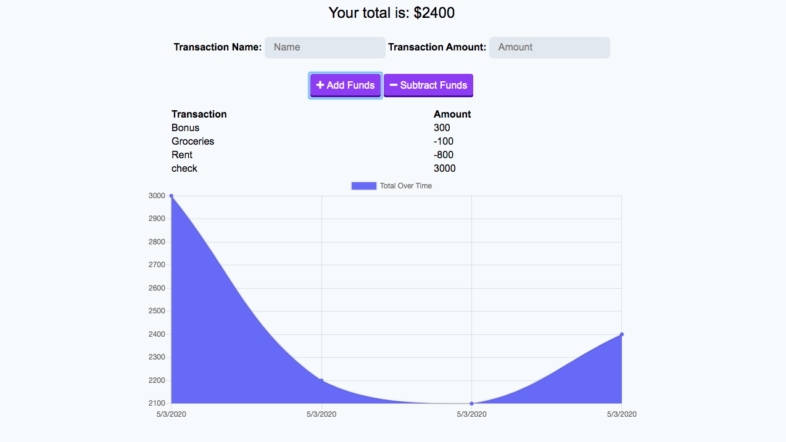

# budget-tracker-app

A progressive web application for tracking your budget.

# Visuals

# Usage
1. Navigate to https://fast-bastion-53832.herokuapp.com/
2. Add funds to your budget
3. Subtract funds from your budget
4. Bugdet is represented with a graph
5. App will continue to work when you are offline.
6. When you again have connectivity any changes will be synched with the MongoDB
 
# What I learned

**Working with a Progressive Web App
**Creating Service Worker and webmanifests
**MongoDB / Mongoose for DB CRUD

# Links to Project

GitHub 

Heroku https://fast-bastion-53832.herokuapp.com/

